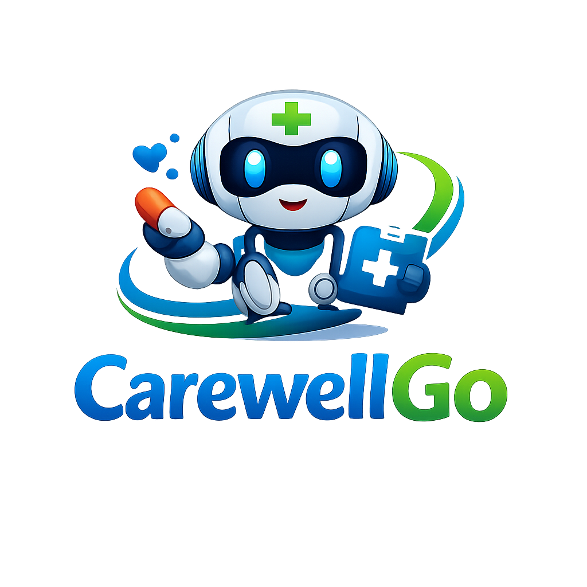

# 🤖 CareWellGO — Smart Robotic Healthcare Platform

> *"Where Robotics Meets Medicine — AI-Powered, 24/7, Always Ready."*



---

## 📌 Overview

**CareWellGO** Is A Premium, Full-Featured Smart Robotic Healthcare Platform Built With Vanilla HTML, CSS, And JavaScript. It Features A Real Browser-Based Patient Database (localStorage), Live Vitals Monitoring, AI Chat, Emergency SOS, And More.

---

## 🗂️ Project Structure

```
carewellgo.github.io/
│
├── index.html               ← 🏠 Home Page
├── AI/index.html            ← 🤖 Medical AI Chat
├── Chat_Bot/index.html      ← 💬 AI Chat Bot Interface
├── Contact/index.html       ← 📞 Contact & Support
├── Dashboard/index.html     ← 📊 Health Dashboard
├── Emergency/index.html     ← 🚨 Emergency SOS System
├── Project_Explanation.md   ← 📄 This File
│
└── Files/
    ├── CSS/
    │   ├── Common.css          ← 🎨 Global Styles (Nav, Footer, Tokens, Responsive)
    │   ├── Index.css           ← Home Page Styles
    │   ├── Ai.css              ← AI Page Styles
    │   ├── Chat_Bot.css        ← ChatBot Styles
    │   ├── Contact.css         ← Contact Page Styles
    │   ├── Dashboard.css       ← Dashboard Styles
    │   └── Emergency.css       ← Emergency Styles
    │
    ├── JS/
    │   ├── Db.js               ← 🗄️ LocalStorage Mini-Database Engine
    │   ├── Index.js            ← Home Logic (Counter, Animations, Popup)
    │   ├── Ai.js               ← Medical AI Response Engine
    │   ├── Chat_Bot.js         ← Chat Bot Logic
    │   ├── Contact.js          ← Form Validation & Submission Storage
    │   ├── Dashboard.js        ← Vitals, Charts, Scan, Patient Profile
    │   └── Emergency.js        ← SOS Timer & Status Management
    │
    └── Images/
        ├── Logo.png
        ├── Named_Logo.png
        ├── Robo.png
        └── Top_Img.png
```

---

## 🌟 Pages & Features

| Page | URL | Key Features |
|------|-----|-------------|
| 🏠 Home | `/` | Hero, Stats Counter, 6-Feature Grid, CTA, Discount Popup |
| 🤖 Medical AI | `/AI/` | Welcome Splash → AI Chat With Persistent History (DB) |
| 💬 Chat Bot | `/Chat_Bot/` | Power Toggle, Keyword Responses, Persistent Chat (DB) |
| 📞 Contact | `/Contact/` | Validated Form, Submissions Stored In DB, History Panel |
| 📊 Dashboard | `/Dashboard/` | Live Vitals, Charts, Scan Simulation, Edit Patient Profile (DB) |
| 🚨 Emergency | `/Emergency/` | SOS Countdown, Hospital Routing, Patient Bio From DB |

---

## 🗄️ Browser Mini-Database (localStorage)

All User Data Persists In The Browser Under Key `CareWellGO_DB`:

```json
{
  "Patient": {
    "Name": "Patient",
    "Age": 25,
    "Blood_Group": "O+",
    "Allergies": "None",
    "Emergency_Contact": "+91 555 000 0000",
    "Location": "Not Set",
    "ID": "HRB-XXXX"
  },
  "Vitals_History": [...],
  "AI_Chat": [...],
  "Bot_Chat": [...],
  "Contact_Messages": [...]
}
```

> Data Survives Page Refreshes And Browser Restarts. Clear With `localStorage.clear()` In DevTools.

---

## 🎨 Design System

| Token | Value | Usage |
|-------|-------|-------|
| `--Clr_Bg` | `#030e1e` | Page Background |
| `--Clr_Cyan` | `#00e5ff` | Primary Accent |
| `--Clr_Green` | `#00e676` | Status Online / Success |
| `--Clr_Red` | `#ff1744` | Emergency / Error |
| `--Clr_Text_Muted` | `#546e7a` | Secondary Text |
| `--Nav_H` | `70px` | Navigation Height |

---

## ⚡ Tech Stack

| Technology | Usage |
|------------|-------|
| **HTML5** | Semantic Page Structure |
| **Vanilla CSS** | Custom Design System, Responsive Layouts |
| **JavaScript (ES6+)** | Interaction, DB Engine, Animations |
| **localStorage** | Browser-Side Mini Database |
| **Chart.js CDN** | Health Data Visualization |
| **Google Fonts (Inter)** | Modern Typography |

---

## 📱 Responsive Breakpoints

| Breakpoint | Range | Layout |
|------------|-------|--------|
| Mobile | 0 – 480px | Single Column, Hamburger Nav |
| Tablet | 481 – 768px | 2-Column Grids, Compact Views |
| Laptop | 769 – 1440px | Full Multi-Column Layout |
| Extreme | > 1441px | Max Width 1440px Centered |

---

## 🐛 Bugs Fixed

- ✅ Typo `emerency.js` → `Emergency.js`
- ✅ Trailing Stray `S` At End Of AI Script Fixed
- ✅ Broken `<button>` Wrapping `<a>` Tag Fixed
- ✅ All Tailwind CDN Dependencies Removed (Now Pure CSS)
- ✅ All Hardcoded Pixel Widths Replaced With Responsive Units

---

## 🚀 Setup & Usage

1. Clone Or Download The Repository
2. Open `index.html` In Any Modern Browser
3. Navigate Using The Site Menu
4. Visit **Dashboard** First To Set Up Your Patient Profile

> ✨ No Build Step Required — Pure HTML/CSS/JS Static Site!

---

*Made With ❤️ By The CareWellGO Team · © 2025 All Rights Reserved*
